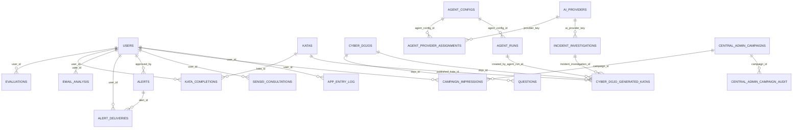

# Base de Datos - Ciber Dojo

Documento generado a partir de la lectura completa y verificada de las 21 migraciones en `supabase/migrations/001_initial_schema.sql` a `021_campaign_impressions_sector.sql`. Cada tabla, columna, política RLS, vista y función aquí listada existe literalmente en esas migraciones (se cita el número de migración de origen entre corchetes). No se incluye nada no verificado en el código fuente.

Motor: PostgreSQL (Supabase). Extensiones usadas: `uuid-ossp`, `pgcrypto` [001].

## Índice

1. Tablas de usuarios y evaluación
2. Tablas de entrenamiento (katas, dojos, preguntas)
3. Tablas de alertas y patrocinadores
4. Tablas de IA / agentes
5. Tablas de administración central (campañas, sectores)
6. Tablas de integración T-Pot (honeypot)
7. Tablas de seguridad/auditoría
8. Vistas
9. Funciones
10. Hallazgos sobre RLS (tablas sin política de escritura o sin RLS)
11. Diagrama entidad-relación

---

## 1. Tablas de usuarios y evaluación

### `users` [001, alterada en 004, 012, 014, 020]

Columnas:
- `id UUID PK DEFAULT gen_random_uuid()`
- `email TEXT UNIQUE NOT NULL`
- `phone TEXT`
- `full_name TEXT`
- `business_type TEXT` — el CHECK original de 001 (`pescador, agricultor, comerciante, restaurante, ferreteria, farmacia, otro`) fue eliminado en la migración 016 al introducir el catálogo `business_sectors`; ahora se valida a nivel de aplicación (Edge Function `secure-register-user`) contra `business_sectors`.
- `belt TEXT DEFAULT 'white'` — CHECK evolucionó en 3 pasos: 001 = `white,yellow,orange,green,brown,black`; 015 lo reemplazó por `white,yellow,orange,green,blue,purple,red,black`; 017 lo corrigió a la versión final vigente: `white,yellow,orange,green,blue,brown,black` (fusionó `purple`/`red` en `brown`).
- `total_points INT DEFAULT 0` — puntos de gamificación únicamente; comentario agregado en 015 aclarando que el puntaje de riesgo vive en `evaluations.total_score`, no aquí.
- `current_risk_level TEXT` CHECK (`bajo,medio,alto,critico`)
- `location_city TEXT`, `location_province TEXT`
- `created_at`, `updated_at TIMESTAMPTZ DEFAULT NOW()` (trigger `update_users_updated_at` [001])
- `last_evaluation_at TIMESTAMPTZ`
- `onboarding_completed BOOLEAN DEFAULT FALSE`
- `role TEXT NOT NULL DEFAULT 'user'` CHECK (`user,admin,analyst`) [004]
- `email_encrypted JSONB`, `full_name_encrypted JSONB`, `phone_encrypted JSONB`, `location_city_encrypted JSONB`, `location_province_encrypted JSONB` [012] — cifrado AES-256-GCM, ver `SECURITY_PRIVACY.md`
- `email_lookup_hmac TEXT` [012] (indexado, búsqueda exacta por HMAC-SHA-256)
- `pii_key_version INTEGER DEFAULT 1` [012]
- `pii_encrypted_at TIMESTAMPTZ` [012]
- `pii_migration_status TEXT NOT NULL DEFAULT 'pending'` [012] (indexado)
- `data_processing_authorized BOOLEAN NOT NULL DEFAULT false` [012]
- `data_processing_authorized_at TIMESTAMPTZ` [012]
- `privacy_notice_version TEXT NOT NULL DEFAULT '2026-06-22'` [012]
- `privacy_updated_at TIMESTAMPTZ` [012]
- `email_domain TEXT` [014] (indexado; usado para excluir proveedores públicos del ranking)
- `sector TEXT` [020] — snapshot de `business_sectors.industry` al momento del registro; `NULL` significa "coincide con todos los sectores" (usado deliberadamente para cuentas legado/prueba)

Triggers: `update_users_updated_at` [001]; `prevent_user_security_field_tampering_trigger` [005] — bloquea que un usuario autenticado (no admin, no service_role) cambie `role`, `belt`, `current_risk_level` o `last_evaluation_at` vía UPDATE directo, y fuerza `role='user'` en cualquier INSERT hecho por el propio cliente.

RLS: habilitado [002]. Políticas: usuario ve/edita/inserta su propio perfil (`auth.uid() = id`) [002]; admin puede ver todos los usuarios y actualizar usuarios (`is_admin()`) [004].

### `evaluations` [001]

Historial de evaluaciones de riesgo.

- `id UUID PK`
- `user_id UUID FK -> users(id) ON DELETE CASCADE`
- `evaluation_date TIMESTAMPTZ DEFAULT NOW()`
- `total_score INT NOT NULL` — puntaje de riesgo (no confundir con `users.total_points`)
- `risk_level TEXT NOT NULL`
- `belt_awarded TEXT`
- `vector_scores JSONB`
- `responses JSONB NOT NULL`
- `prompt_version TEXT`, `ai_used TEXT`, `ai_response_time_ms INT`
- `completed BOOLEAN DEFAULT TRUE`

Índices: `idx_evaluations_user(user_id)`, `idx_evaluations_date(evaluation_date DESC)`.

RLS: habilitado [002]. Usuario ve/inserta sus propias evaluaciones [002]; admin ve todas [004].

### `questions` [001, alterada en 004, 007, 011, actualizada en 013]

Banco de preguntas del cuestionario adaptativo y de los dojos.

- `id TEXT PK`
- `branch TEXT NOT NULL` — identificador de rama/dojo
- `order_num INT`
- `iso_control TEXT`
- `question_text TEXT NOT NULL`
- `question_type TEXT` CHECK (`unica_opcion, multiple_opcion, escenario`)
- `options JSONB NOT NULL`
- `conditional_logic JSONB`
- `active BOOLEAN DEFAULT TRUE`
- `created_at TIMESTAMPTZ DEFAULT NOW()`
- `source_type TEXT NOT NULL DEFAULT 'manual'` CHECK (`manual, incident_investigation, audited_generated`) [004]
- `generated_from_incident_id UUID` [004]
- `generation_prompt_version TEXT` [004]
- `audit_status TEXT NOT NULL DEFAULT 'approved'` CHECK (`pending, approved, rejected`) [004]
- `audit_notes TEXT`, `reviewed_at TIMESTAMPTZ` [004]
- `dojo_id TEXT FK -> cyber_dojos(id) ON DELETE SET NULL` [007]
- `difficulty INT` CHECK (1-5) [007]
- `kata_label TEXT` [007]
- `answer_text TEXT`, `explanation TEXT` [007]
- `editable BOOLEAN NOT NULL DEFAULT TRUE` [007]
- `updated_at TIMESTAMPTZ NOT NULL DEFAULT NOW()` [007] (trigger `touch_questions_updated_at`)
- `audit_provider TEXT`, `audit_model TEXT` [011]
- `audit_replaced_content BOOLEAN DEFAULT false` [011]
- `audit_original_payload JSONB`, `audit_corrected_payload JSONB` [011]
- `audit_reviewed_at TIMESTAMPTZ` [011]

Nota de contenido: la migración 013 (`010_plain_language_portal_text.sql` según el nombre de archivo, pero versionada como aplicada antes de 011 en el repo) reescribió en texto plano términos técnicos (MFA→"verificación en dos pasos", phishing→"mensaje falso para robar datos", etc.) en `question_text`, `answer_text`, `explanation` y `options` para simplificar el lenguaje a usuarios no técnicos.

Índices: `idx_questions_branch(branch)` [001]; `idx_questions_dojo_order(dojo_id, source_type, order_num)`, `idx_questions_audit_status(audit_status)` [007].

RLS: habilitado [002]. Público ve preguntas activas [002]; admin ve todas, inserta y actualiza [004].

### `katas` [001, sembrada en 003 y 009, renombrada en 017]

Simulaciones prácticas y exámenes de cinturón (mismo modelo de datos para ambos).

- `id UUID PK`
- `kata_code TEXT UNIQUE NOT NULL`
- `name TEXT NOT NULL`
- `description TEXT`, `teaching TEXT`
- `estimated_minutes INT`
- `required_belt TEXT` — CHECK alineado al mismo path de `users.belt` (ver 015/017 arriba)
- `points_reward INT DEFAULT 100`
- `steps JSONB` — para exámenes de cinturón (sembrados en 009) contiene un arreglo de preguntas de opción múltiple con `question, term, term_explanation, options, correct, explanation`
- `verification_type TEXT` CHECK (`manual, automatic, self_report`)
- `active BOOLEAN DEFAULT TRUE`

La migración 017 fusionó los exámenes `EXAM_MORADO_ROJO` y `EXAM_ROJO_NEGRO` (creados en 009 bajo el path de 8 cinturones) en un único `EXAM_MARRON_NEGRO`, concatenando el contenido de ambos (`steps`) para no perder preguntas ya redactadas, y renombró `EXAM_AZUL_MORADO` a `EXAM_AZUL_MARRON`. El registro `EXAM_MORADO_ROJO` original quedó con `active = FALSE` en vez de borrarse.

RLS: habilitado [002]. Único policy encontrado: público ve katas activas (`active = TRUE`) [002]. **No se encontró una política de administración (INSERT/UPDATE/DELETE) para `katas` en ninguna de las 21 migraciones** — ver sección 10.

### `kata_completions` [001]

- `id UUID PK`
- `user_id UUID FK -> users(id) ON DELETE CASCADE`
- `kata_id UUID FK -> katas(id) ON DELETE CASCADE`
- `completed_at TIMESTAMPTZ DEFAULT NOW()`
- `verification_data JSONB`
- `points_earned INT`
- `UNIQUE(user_id, kata_id)` — un usuario completa cada kata una sola vez

Índice: `idx_kata_completions_user(user_id)`.

RLS: habilitado [002]. Usuario ve/inserta sus propias completaciones [002]; admin ve todas [004].

---

## 2. Tablas de alertas y patrocinadores

### `email_analysis` [001]

- `id UUID PK`
- `user_id UUID FK -> users(id) ON DELETE CASCADE`
- `analyzed_at TIMESTAMPTZ DEFAULT NOW()`
- `sender_domain TEXT`, `sender_display_name TEXT`
- `spf_pass BOOLEAN`, `dkim_pass BOOLEAN`, `dmarc_pass BOOLEAN`
- `typosquatting_detected BOOLEAN DEFAULT FALSE`
- `urls_count INT DEFAULT 0`, `malicious_urls_count INT DEFAULT 0`
- `verdict TEXT` CHECK (`seguro, sospechoso, peligroso`)
- `threat_type TEXT`
- `confidence_score DECIMAL(3,2)`

Índices: `idx_email_analysis_user`, `idx_email_analysis_verdict`.

RLS: habilitado [002]. Usuario ve/inserta sus propios análisis [002]. **No se encontró política admin explícita para esta tabla.**

### `domains_whitelist` [001]

- `id UUID PK`, `entity_name TEXT NOT NULL`, `domains TEXT[] NOT NULL`
- `entity_type TEXT` CHECK (`banco, gobierno, proveedor, otro`)
- `active BOOLEAN DEFAULT TRUE`, `added_at TIMESTAMPTZ DEFAULT NOW()`

Sembrada en 003 con 6 bancos ecuatorianos y 5 entidades de gobierno (SRI, EcuCERT, Superintendencia de Bancos, Registro Civil, Ministerio de Telecomunicaciones).

RLS: habilitado [002]. Único policy: público ve dominios activos [002]. **No se encontró política de escritura (admin) en ninguna migración.**

### `alerts` [001, alterada en 004]

- `id UUID PK`
- `title TEXT NOT NULL`, `description TEXT NOT NULL`
- `threat_type TEXT NOT NULL`
- `severity TEXT` CHECK (`baja, media, alta, critica`)
- `source TEXT`, `source_url TEXT`
- `target_business_types TEXT[]`, `target_banks TEXT[]`
- `published_at TIMESTAMPTZ DEFAULT NOW()`, `expires_at TIMESTAMPTZ`
- `approved_by UUID FK -> users(id)`
- `active BOOLEAN DEFAULT TRUE`
- `related_question_ids TEXT[] DEFAULT '{}'`, `related_incident_id UUID`, `source_agent TEXT` [004]

Índices: `idx_alerts_active`, `idx_alerts_severity`.

Sembrada en 003 con 2 alertas de ejemplo (phishing bancario, fraude WhatsApp).

RLS: habilitado [002]. Público ve alertas activas [002]; admin gestiona todas (`FOR ALL`) [004].

### `alert_deliveries` [001]

- `id UUID PK`
- `alert_id UUID FK -> alerts(id) ON DELETE CASCADE`
- `user_id UUID FK -> users(id) ON DELETE CASCADE`
- `delivered_at TIMESTAMPTZ DEFAULT NOW()`, `opened_at TIMESTAMPTZ`
- `action_taken TEXT`
- `UNIQUE(alert_id, user_id)`

RLS: habilitado [002]. Usuario ve/inserta sus propias entregas [002]. Según `DOCUMENTO_FUNCIONALIDADES.md` (revisado en este mismo trabajo de auditoría), esta tabla existe en el esquema pero no se encontraron pantallas del frontend que la usen activamente — confirmar contra el inventario de pantallas antes de darlo por definitivo.

### `sponsors` [001]

- `id UUID PK`, `business_name TEXT NOT NULL`
- `sponsor_type TEXT` CHECK (`banco, antivirus, tecnico, aseguradora, otro`)
- `coverage_provinces TEXT[]`, `services JSONB`
- `subscription_tier TEXT`, `monthly_fee DECIMAL(10,2)`
- `matching_rules JSONB`, `active BOOLEAN DEFAULT TRUE`
- `contact_email TEXT`, `contact_phone TEXT`

**RLS no aparece habilitado para esta tabla en ninguna de las 21 migraciones** (no está en la lista de `ALTER TABLE ... ENABLE ROW LEVEL SECURITY` de 002 ni se habilita después). Ver sección 10.

---

## 3. Tablas de IA / agentes

### `ai_configs` [001]

- `id UUID PK`, `config_name TEXT UNIQUE NOT NULL`
- `primary_ai TEXT NOT NULL`, `primary_timeout_ms INT DEFAULT 8000`
- `fallback_ai TEXT`, `fallback_timeout_ms INT DEFAULT 5000`
- `tertiary_ai TEXT`
- `temperature DECIMAL(3,2) DEFAULT 0.10`, `max_tokens INT DEFAULT 500`
- `prompt_version TEXT`, `active BOOLEAN DEFAULT TRUE`, `updated_at TIMESTAMPTZ DEFAULT NOW()` (trigger `update_ai_configs_updated_at`)

Sembrada en 003 con una única fila `default`: primaria DeepSeek (8000ms), fallback Kimi (5000ms), terciaria Claude.

**RLS no aparece habilitado para esta tabla.** Ver sección 10.

### `recommendations_cache` [001]

- `id UUID PK`, `query_hash TEXT UNIQUE NOT NULL`
- `risk_profile JSONB NOT NULL`, `recommendation_text TEXT NOT NULL`
- `ai_used TEXT`, `created_at TIMESTAMPTZ DEFAULT NOW()`
- `hit_count INT DEFAULT 0`, `last_hit_at TIMESTAMPTZ`

Índice: `idx_recommendations_hash`.

**RLS no aparece habilitado para esta tabla.** Ver sección 10.

### `ai_providers` [004]

- `provider_key TEXT PK`, `label TEXT NOT NULL`
- `provider_type TEXT NOT NULL`, `model_name TEXT NOT NULL`
- `purpose TEXT`, `active BOOLEAN DEFAULT TRUE`, `created_at TIMESTAMPTZ DEFAULT NOW()`

Sembrada en 004 con 3 proveedores: `deepseek` (deepseek-chat), `kimi` (moonshot-v1-8k), `claude` (claude-haiku-4-5-20251001).

RLS: habilitado [004]. Admin gestiona todo (`FOR ALL`) [004].

### `agent_configs` [004, CHECK extendido en 007 y 011]

- `id UUID PK`
- `agent_code TEXT UNIQUE NOT NULL` — CHECK evolucionó: 004 solo permitía `incident-investigator, question-auditor`; 007 agregó `ciber-dojo-news-agent`; 011 agregó `sensei-question-auditor` (valor final: los 4 códigos)
- `name TEXT NOT NULL`, `description TEXT`
- `enabled BOOLEAN DEFAULT TRUE`
- `trigger_time TIME NOT NULL DEFAULT '07:00:00'`, `timezone TEXT NOT NULL DEFAULT 'America/Guayaquil'`
- `prompt_template TEXT NOT NULL`
- `investigation_window_days INT DEFAULT 1`
- `last_run_at TIMESTAMPTZ`
- `extra_settings JSONB DEFAULT '{}'`
- `created_at`, `updated_at TIMESTAMPTZ` (trigger `update_agent_configs_updated_at`)

Los 4 agentes configurados por seed:
1. `incident-investigator` [004, prompt actualizado en 006] — investiga incidentes del día anterior, genera hasta 10 preguntas.
2. `question-auditor` [004, prompt actualizado en 006] — audita preguntas generadas.
3. `ciber-dojo-news-agent` [007] — busca noticias en `cyber_news_sources`, genera hasta 10 preguntas y 5 katas por ejecución, requiere revisión admin.
4. `sensei-question-auditor` [011] — valida/corrige en tiempo real las respuestas del Sensei antes de mostrarlas al usuario, timeout 12000ms, temperatura 0.1, max 1200 tokens.

RLS: habilitado [004]. Admin gestiona todo [004].

### `agent_provider_assignments` [004]

- `id UUID PK`
- `agent_config_id UUID FK -> agent_configs(id) ON DELETE CASCADE`
- `provider_key TEXT FK -> ai_providers(provider_key) ON DELETE CASCADE`
- `priority INT DEFAULT 1`, `active BOOLEAN DEFAULT TRUE`
- `UNIQUE(agent_config_id, provider_key)`

Define, por agente, el orden de fallback entre proveedores de IA (ej. `incident-investigator`: deepseek→kimi→claude; `question-auditor`: claude→deepseek; `sensei-question-auditor`: claude→deepseek→kimi).

RLS: habilitado [004]. Admin gestiona todo [004].

### `incident_investigations` [004]

- `id UUID PK`, `incident_date DATE NOT NULL`
- `title TEXT NOT NULL`, `summary TEXT NOT NULL`
- `severity TEXT NOT NULL` CHECK (`baja, media, alta, critica`)
- `source_name TEXT`, `source_url TEXT`
- `ai_provider_key TEXT FK -> ai_providers(provider_key)`
- `raw_payload JSONB`
- `generated_question_ids TEXT[] DEFAULT '{}'`
- `status TEXT NOT NULL DEFAULT 'detectado'` CHECK (`detectado, preguntas_generadas, auditado, descartado`)
- `created_at TIMESTAMPTZ DEFAULT NOW()`

Índices: `idx_incident_investigations_date`, `idx_incident_investigations_severity`.

RLS: habilitado [004]. Admin gestiona todo [004].

### `agent_runs` [004]

- `id UUID PK`
- `agent_config_id UUID FK -> agent_configs(id) ON DELETE CASCADE`
- `run_date DATE NOT NULL DEFAULT CURRENT_DATE`
- `started_at TIMESTAMPTZ DEFAULT NOW()`, `finished_at TIMESTAMPTZ`
- `status TEXT NOT NULL DEFAULT 'running'` CHECK (`running, completed, failed`)
- `summary TEXT`, `input_payload JSONB`, `output_payload JSONB`
- `triggered_by TEXT DEFAULT 'system'`, `error_message TEXT`

Índice: `idx_agent_runs_agent_date`.

RLS: habilitado [004]. Admin gestiona todo [004].

---

## 4. Tablas de administración central: dojos, campañas, sectores

### `cyber_dojos` [007]

- `id TEXT PK`, `name TEXT NOT NULL`, `theme TEXT NOT NULL`
- `iso_control TEXT`
- `status TEXT NOT NULL DEFAULT 'draft'` CHECK (`active, draft, paused, archived`)
- `manual_question_target INT NOT NULL DEFAULT 20`, `ai_question_target INT NOT NULL DEFAULT 30`
- `display_order INT NOT NULL DEFAULT 100`
- `metadata JSONB DEFAULT '{}'`
- `created_at`, `updated_at TIMESTAMPTZ` (trigger `touch_cyber_dojos_updated_at`)

Índice: `idx_cyber_dojos_status_order`.

Sembrados 3 dojos en 007: `dojo-phishing` (activo), `dojo-passwords` (activo), `dojo-backups` (borrador) — cada uno con objetivo de 20 preguntas manuales + 30 IA.

RLS: habilitado [007]. Público ve dojos activos (`status='active'`); admin gestiona todo.

### `cyber_dojo_wisdom_quotes` [007]

- `id UUID PK`, `source_title TEXT NOT NULL`, `source_file TEXT`
- `quote_text TEXT NOT NULL`, `cyber_application TEXT NOT NULL`
- `tags TEXT[] DEFAULT '{}'`
- `active BOOLEAN DEFAULT TRUE`, `display_weight INT DEFAULT 1`
- `created_at`, `updated_at TIMESTAMPTZ`

Sembradas 5 frases (3 de "El arte de la guerra" - Sun Tzu, 2 de "Bushido - El Código del Samurái") con su aplicación a ciberseguridad, referenciando archivos reales en `frases/`.

RLS: habilitado [007]. Público ve frases activas; admin gestiona todo.

### `cyber_news_sources` [007]

- `id UUID PK`, `name TEXT NOT NULL`, `url TEXT NOT NULL UNIQUE`
- `source_type TEXT DEFAULT 'web'` CHECK (`web, rss, api`)
- `enabled BOOLEAN DEFAULT TRUE`, `priority INT DEFAULT 100`, `notes TEXT`

Sembradas 4 fuentes: CISA Cybersecurity Advisories, BleepingComputer, The Hacker News, EcuCERT.

RLS: habilitado [007]. **Solo tiene política de administración** (`Admins can manage cyber news sources`, `FOR ALL`) — no hay política pública de lectura, coherente con ser una tabla de configuración interna del agente de noticias.

### `cyber_dojo_generated_katas` [007]

- `id UUID PK`
- `dojo_id TEXT FK -> cyber_dojos(id) ON DELETE SET NULL`
- `incident_investigation_id UUID FK -> incident_investigations(id) ON DELETE SET NULL`
- `source_url TEXT`, `title TEXT NOT NULL`, `scenario TEXT NOT NULL`, `task TEXT NOT NULL`
- `difficulty INT NOT NULL DEFAULT 1` CHECK (1-5)
- `status TEXT NOT NULL DEFAULT 'draft'` CHECK (`draft, approved, rejected, published`)
- `published_kata_id UUID FK -> katas(id) ON DELETE SET NULL`
- `created_by_agent_run_id UUID FK -> agent_runs(id) ON DELETE SET NULL`
- `audit_notes TEXT`, `metadata JSONB DEFAULT '{}'`
- `created_at`, `updated_at TIMESTAMPTZ`

Katas propuestas por el agente de noticias, pendientes de revisión admin antes de publicarse como fila real en `katas` (vía función `publish_generated_kata`, sección 9).

RLS: habilitado [007]. Público ve solo las publicadas (`status='published'`); admin gestiona todo.

### `central_admin_campaigns` [007, alterada en 018 y 020]

Popups publicitarios/informativos mostrados a los usuarios.

- `id UUID PK`, `name TEXT NOT NULL`
- `moment TEXT NOT NULL DEFAULT 'inicio'` CHECK (`inicio, sesion, salida`) [007]
- `duration_seconds INT NOT NULL DEFAULT 10` [007]
- `validity_type TEXT NOT NULL DEFAULT 'indefinido'` CHECK (`sesiones, meses, indefinido`) [007]
- `validity_value INT` [007]
- `message TEXT NOT NULL` [007]
- `active BOOLEAN NOT NULL DEFAULT TRUE` [007] — mantenido sincronizado automáticamente por trigger tras 018 (ver abajo)
- `starts_at TIMESTAMPTZ`, `ends_at TIMESTAMPTZ` [007]
- `created_at`, `updated_at TIMESTAMPTZ` [007]
- `image_url TEXT`, `link_url TEXT` [018]
- `status TEXT NOT NULL DEFAULT 'activa'` CHECK (`activa, suspendida, eliminada`) [018] — reemplaza a `active` como fuente de verdad; el trigger `sync_campaign_active_from_status` [018] mantiene `active = (status = 'activa')` para lectores legado
- `target_all BOOLEAN NOT NULL DEFAULT TRUE` [020]
- `target_sectors TEXT[] NOT NULL DEFAULT '{}'` [020]

Las 2 campañas de ejemplo sembradas en 007 (`Plan de soporte MFA`, `Curso anti-phishing`) fueron eliminadas explícitamente por la migración 018 (`DELETE ... WHERE name IN (...)`), por lo que **no hay campañas de ejemplo/demo activas en el esquema actual** — cualquier campaña presente en producción fue creada desde el panel admin.

RLS: habilitado [007]. Política de lectura evolucionó dos veces: 007 (activa + vigencia por fecha) → 018 (mismo criterio, ahora sobre `status='activa'`) → 020, versión final: `status='activa'` + vigencia por fecha + coincidencia de sector (`target_all=TRUE` O el sector del usuario está en `target_sectors`, con `sector IS NULL` del usuario tratado como comodín). Admin gestiona todo (`FOR ALL`) [007].

### `central_admin_campaign_settings` [018]

Tabla de una sola fila (`id SMALLINT PK DEFAULT 1 CHECK (id=1)`) con la política de validación de imágenes:
- `max_image_kb INT NOT NULL DEFAULT 500`
- `max_image_width INT NOT NULL DEFAULT 1920`, `max_image_height INT NOT NULL DEFAULT 1920`
- `updated_by TEXT`, `updated_at TIMESTAMPTZ DEFAULT now()`

RLS: habilitado [018]. Solo admin (`FOR ALL`).

### `central_admin_campaign_audit` [018]

Bitácora de quién/cuándo creó o cambió una campaña.

- `id UUID PK`
- `campaign_id UUID FK -> central_admin_campaigns(id) ON DELETE SET NULL`
- `actor TEXT NOT NULL`
- `action TEXT NOT NULL` CHECK (`creada, actualizada, estado_cambiado`)
- `details JSONB DEFAULT '{}'`, `created_at TIMESTAMPTZ DEFAULT now()`

Índice: `idx_central_admin_campaign_audit_campaign`.

RLS: habilitado [018]. Admin puede leer (`FOR SELECT`); solo `service_role` puede insertar.

Storage: bucket público `campaign-ads` creado en 018 (`storage.buckets`) para alojar las imágenes subidas.

### `business_sectors` [016, alterada en 019]

Catálogo administrable de sectores/ocupaciones usado en el registro de usuarios.

- `code TEXT PK` CHECK (regex `^[a-z0-9_]{2,40}$`)
- `label TEXT NOT NULL` CHECK (`length(trim(label)) >= 2`)
- `active BOOLEAN NOT NULL DEFAULT TRUE`
- `display_order INT NOT NULL DEFAULT 100`
- `created_at`, `updated_at TIMESTAMPTZ` (trigger `touch_business_sectors_updated_at`)
- `industry TEXT` [019] — agrupador de industria (ej. "Tecnologia de la Informacion", "Salud")

Historia de contenido: 016 sembró 7 categorías genéricas (comerciante, restaurante, ferreteria, farmacia, agricultor, pescador, otro). La migración 019 las reemplazó por un catálogo real de ~79 ocupaciones ecuatorianas agrupadas en 14 industrias (Administración/Finanzas, Agropecuario y Pesca, Comercio y Ventas, Comunicación/Marketing/Artes, Construcción, Educación, Hogar/Cuidados, Hostelería/Turismo, Ingeniería/Manufactura, Legal, Salud, Seguridad/Defensa, Tecnología de la Información, Transporte/Logística), desactivando (`active=FALSE`, no borrando) las 3 categorías genéricas que no mapean 1:1 a una ocupación real (`restaurante`, `ferreteria`, `farmacia`; `comerciante`, `agricultor`, `pescador` y `otro` se mantuvieron activas y ahora también existen como ocupaciones específicas con el mismo código).

RLS: habilitado [016]. Público ve sectores activos; admin gestiona todo.

### `campaign_impressions` [020, alterada en 021]

Registro de qué campaña se le mostró a qué usuario (control de rotación "una por vez" y base de los reportes de impresiones).

- `id UUID PK`
- `campaign_id UUID FK -> central_admin_campaigns(id) ON DELETE CASCADE`
- `user_id UUID FK -> users(id) ON DELETE CASCADE`
- `shown_at TIMESTAMPTZ NOT NULL DEFAULT now()`
- `sector TEXT` [021] — snapshot del sector del usuario al momento de la impresión (`NULL` = usuario comodín), usado para el reporte de desglose por sector

Índices: `idx_campaign_impressions_user`, `idx_campaign_impressions_campaign_time`, `idx_campaign_impressions_sector_time` [021].

RLS: habilitado [020]. Usuario inserta/ve sus propias impresiones; admin ve todas.

### `app_entry_log` [020]

Registro de entradas/sesiones de la app, por sector (tráfico de entrada para reportes).

- `id UUID PK`
- `user_id UUID FK -> users(id) ON DELETE CASCADE`
- `sector TEXT`
- `entered_at TIMESTAMPTZ NOT NULL DEFAULT now()`

Índices: `idx_app_entry_log_time`, `idx_app_entry_log_sector_time`.

RLS: habilitado [020]. Usuario inserta/ve sus propias entradas; admin ve todas.

---

## 5. Tablas de integración T-Pot (honeypot)

Todas creadas en la migración 013, con RLS habilitado y **acceso restringido a administradores** en todos los casos.

### `tpot_integration_settings`
- `id UUID PK`, `enabled BOOLEAN NOT NULL DEFAULT false`
- `base_url TEXT`, `elastic_url_encrypted_or_reference TEXT`
- `verify_tls BOOLEAN NOT NULL DEFAULT true`
- `allowed_indexes TEXT[] DEFAULT ARRAY['logstash-*','tpot-*','cowrie-*','suricata-*','dionaea-*']`
- `created_at`, `updated_at TIMESTAMPTZ`

Política: solo admin (`FOR ALL`).

### `tpot_query_audit`
- `id UUID PK`, `user_id TEXT`, `action TEXT NOT NULL`
- `filters_json JSONB DEFAULT '{}'`, `records_count INTEGER DEFAULT 0`
- `status TEXT NOT NULL DEFAULT 'success'`, `created_at TIMESTAMPTZ DEFAULT now()`

Políticas: admin ve (`FOR SELECT`); solo `service_role` inserta.

### `tpot_ai_analysis_jobs`
- `id UUID PK`, `requested_by TEXT`
- `status TEXT NOT NULL` CHECK (`pending, running, audited, approved, rejected, failed`)
- `filters_json JSONB DEFAULT '{}'`, `sanitized_input_ref TEXT`
- `input_summary_json JSONB DEFAULT '{}'`
- `raw_ai_output JSONB`, `audited_output JSONB`
- `audit_status TEXT`, `audit_notes TEXT`, `approved_output JSONB`
- `model TEXT`, `audit_model TEXT`
- `created_at`, `updated_at TIMESTAMPTZ`
- `approved_by TEXT`, `approved_at TIMESTAMPTZ`

Política: solo admin (`FOR ALL`).

### `tpot_iocs_cache`
- `id UUID PK`, `indicator_type TEXT NOT NULL`
- `indicator_value_hash TEXT NOT NULL`, `indicator_value_masked TEXT NOT NULL`
- `frequency INTEGER DEFAULT 1`
- `first_seen TIMESTAMPTZ`, `last_seen TIMESTAMPTZ`
- `severity TEXT`, `source_honeypot TEXT`, `tags_json JSONB DEFAULT '[]'`
- `created_at`, `updated_at TIMESTAMPTZ`
- `UNIQUE(indicator_type, indicator_value_hash)`

Política: solo admin (`FOR ALL`).

**Nota de alcance:** estas 4 tablas modelan una integración con T-Pot (plataforma de honeypots) y un flujo de análisis con IA auditado antes de aprobación. No se verificó en este trabajo si existe una Edge Function activa que efectivamente llene estas tablas — su presencia en el esquema confirma que la integración fue diseñada e implementada a nivel de base de datos; confirmar el estado operativo real (¿hay un T-Pot desplegado y conectado?) requiere revisión adicional fuera del alcance de este documento.

---

## 6. Tabla de seguridad y auditoría

### `security_audit_events` [012]

- `id UUID PK`
- `actor_user_id UUID`, `event_type TEXT NOT NULL`, `target_user_id UUID`
- `metadata JSONB NOT NULL DEFAULT '{}'`
- `ip_hash TEXT`, `user_agent_hash TEXT`
- `created_at TIMESTAMPTZ NOT NULL DEFAULT now()`

Sin FK explícitas hacia `users` (los IDs se guardan sueltos, posiblemente para conservar el registro aunque el usuario se elimine). Ver `SECURITY_PRIVACY.md` para el detalle de qué eventos se registran (registro completado, fallo de registro, lectura de perfil privado, denegación de lectura, lote de migración PII).

RLS: habilitado [012]. Admin ve (`FOR SELECT`); autenticados pueden insertar (`GRANT INSERT ... TO authenticated`, sin política restrictiva adicional de INSERT en la migración — cualquier usuario autenticado puede insertar un evento de auditoría, no solo `service_role`).

### `sensei_consultations` [008, alterada en 011]

- `id UUID PK`
- `user_id UUID FK -> users(id) ON DELETE SET NULL`
- `question_text TEXT NOT NULL`, `normalized_topic TEXT`
- `is_cybersecurity BOOLEAN NOT NULL DEFAULT FALSE`, `validation_reason TEXT`
- `answer_text TEXT`, `answer_sources JSONB DEFAULT '[]'`
- `matched_question_ids TEXT[] DEFAULT '{}'`
- `used_bank BOOLEAN DEFAULT FALSE`, `used_web BOOLEAN DEFAULT FALSE`
- `auditor_provider TEXT`, `auditor_replaced_answer BOOLEAN DEFAULT FALSE`
- `status TEXT NOT NULL DEFAULT 'answered'` CHECK (`answered, out_of_scope, failed`)
- `feedback_helpful BOOLEAN`, `feedback_text TEXT`
- `sentiment_label TEXT` CHECK (`positivo, neutral, negativo`), `sentiment_score NUMERIC(4,3)`
- `created_at`, `updated_at TIMESTAMPTZ`
- `draft_answer_text TEXT`, `auditor_notes TEXT`, `auditor_model TEXT` [011]
- `auditor_started_at TIMESTAMPTZ`, `auditor_finished_at TIMESTAMPTZ`, `auditor_timeout_ms INTEGER` [011]

Índices: `idx_sensei_consultations_created`, `idx_sensei_consultations_user`, `idx_sensei_consultations_sentiment`.

RLS: habilitado [008]. Usuario inserta/ve/actualiza sus propias consultas (feedback); admin ve/actualiza todas.

---

## 7. Vistas

### `user_statistics_private` [012]
```sql
SELECT business_type, belt, current_risk_level, COUNT(*) AS user_count
FROM public.users
GROUP BY business_type, belt, current_risk_level;
```
Agregado estadístico sin PII, para reportes. `GRANT SELECT ... TO authenticated`.

### `central_admin_question_bank` [007]
`questions` unida a `cyber_dojos` (LEFT JOIN por `dojo_id`), exponiendo `dojo_name`/`dojo_theme` junto a todos los campos administrables de la pregunta. `GRANT SELECT ... TO anon, authenticated`.

### `sensei_consultation_stats` [008]
Agregación diaria (`date_trunc('day', created_at)`) de `sensei_consultations`: total de consultas, consultas sobre ciberseguridad vs. fuera de alcance, conteo de feedback útil/no útil, y conteo por `sentiment_label`. `GRANT SELECT ... TO authenticated`.

### `ai_audit_corrections_report` [011]
`UNION ALL` de dos fuentes — consultas del Sensei corregidas por su auditor (`sensei_consultations` donde `auditor_replaced_answer=true`) y preguntas del banco corregidas por auditoría de IA (`questions` donde `audit_replaced_content=true`) — filtrado internamente por `WHERE public.is_admin()` dentro de la propia vista (no solo por RLS de la tabla base). `GRANT SELECT ... TO authenticated`.

---

## 8. Funciones

| Función | Migración | Tipo | Propósito |
|---|---|---|---|
| `update_updated_at_column()` | 001 | trigger | Actualiza `updated_at = NOW()` genérico (usado por `users`, `ai_configs`) |
| `is_admin()` | 004 | `SECURITY DEFINER`, callable | `TRUE` si `auth.uid()` corresponde a una fila de `users` con `role='admin'`. Base de casi todas las políticas RLS de administración |
| `prevent_user_security_field_tampering()` | 005 | trigger `SECURITY DEFINER` | Bloquea que un cliente no-admin/no-service_role cambie `role`, `belt`, `current_risk_level` o `last_evaluation_at` en `users`; fuerza `role='user'` en INSERT propio |
| `touch_updated_at()` | 007 | trigger | Igual que `update_updated_at_column()`, usado por las tablas creadas desde 007 en adelante |
| `publish_generated_kata(generated_kata_id UUID)` | 007 | `SECURITY DEFINER`, callable | Solo admin. Convierte una fila `cyber_dojo_generated_katas` en una fila real de `katas` (kata_code `GEN_<uuid>`, cinturón derivado de `difficulty`, puntos `100 + difficulty*50`), y marca el origen como `published` |
| `save_business_sector(...)` | 016, firma reemplazada en 019 (agrega `sector_industry`) | `SECURITY DEFINER`, callable | Solo admin. Crea/edita un sector; si cambia el `code`, propaga el cambio a `users.business_type` y `alerts.target_business_types` |
| `sync_campaign_active_from_status()` | 018 | trigger | Mantiene `central_admin_campaigns.active` sincronizado con `status='activa'` |
| `get_next_campaign_for_user(p_moment TEXT DEFAULT 'inicio')` | 020 | `SECURITY DEFINER`, callable | Devuelve la siguiente campaña elegible que el usuario autenticado no ha visto para ese `moment` (ordenado por `created_at ASC`, filtrado por sector); si ya vio todas, reinicia el ciclo desde la más antigua en vez de no mostrar nada |

---

## 9. Hallazgos sobre RLS (observados, no interpretados)

Estos son hechos verificables leyendo las 21 migraciones — no son fallas necesariamente intencionadas ni bugs confirmados, pero deben quedar documentados para la auditoría tal como están, porque **no aparece ninguna migración posterior que los corrija**:

1. **`sponsors`, `ai_configs`, `recommendations_cache` nunca reciben `ENABLE ROW LEVEL SECURITY`.** Quedan con el comportamiento por defecto de PostgreSQL (accesible según los `GRANT` de rol, sin política de fila). Como no se declaró RLS, tampoco hay `GRANT` explícito documentado en estas migraciones más allá del acceso de `service_role` (implícito) — el acceso real depende de los roles de Supabase (`anon`/`authenticated`) que no se restringieron aquí.
2. **`domains_whitelist` y `katas` tienen RLS habilitado y una política pública de lectura, pero ninguna política de escritura para admin** en las 21 migraciones revisadas. En la práctica esto es coherente con que la edición se hace vía `service_role` (Edge Functions / admin backend con clave de servicio, que ignora RLS), pero no hay una política SQL explícita que documente/limite ese acceso de escritura a nivel de base de datos.
3. **`email_analysis` y `alert_deliveries`** solo tienen políticas para que el propio usuario vea/inserte sus filas; no se encontró una política admin de lectura total, a diferencia de `evaluations` y `kata_completions` que sí la tienen.
4. **`security_audit_events`** permite `INSERT` a cualquier usuario autenticado (`GRANT INSERT ... TO authenticated`) sin una política RLS de `WITH CHECK` que lo restrinja — cualquier cliente autenticado puede escribir un evento de auditoría arbitrario (no solo el backend). La lectura sí está restringida a admin.

Recomendación para el auditor: estos 4 puntos fueron solventados mediante la migración correctiva `supabase/migrations/022_security_hardening_rls.sql`, la cual activó RLS con políticas de administración en `sponsors`, `ai_configs` y `recommendations_cache`, otorgó políticas de administración explícitas en `katas` y `domains_whitelist`, y revocó permisos de inserción directa no controlada en `security_audit_events`.

---

## 10. Diagrama entidad-relación

Incluye únicamente relaciones declaradas con `REFERENCES` en las migraciones (claves foráneas reales), agrupadas por dominio.



Notas sobre el diagrama:
- `business_sectors` no tiene FK real hacia `users.business_type` ni `users.sector` (son coincidencias por valor de texto, validadas a nivel de aplicación/función, no por `REFERENCES`) — se omite del diagrama por esa razón, aunque la relación lógica existe y está documentada en la sección 4.
- `questions.generated_from_incident_id` no tiene FK declarada hacia `incident_investigations` (es `UUID` suelto) pese a la relación lógica — se omite del diagrama por el mismo criterio de "solo FKs reales".
- Las tablas T-Pot (sección 5) no tienen FKs hacia el resto del esquema y se omiten del diagrama.

---

*Documento generado el 2026-09-08 a partir de la lectura línea por línea de `supabase/migrations/001_initial_schema.sql` a `021_campaign_impressions_sector.sql`. Cualquier cambio de esquema posterior a estas 21 migraciones no está reflejado aquí.*

RLS: habilitado [004]. Admin gestiona todo [004].
